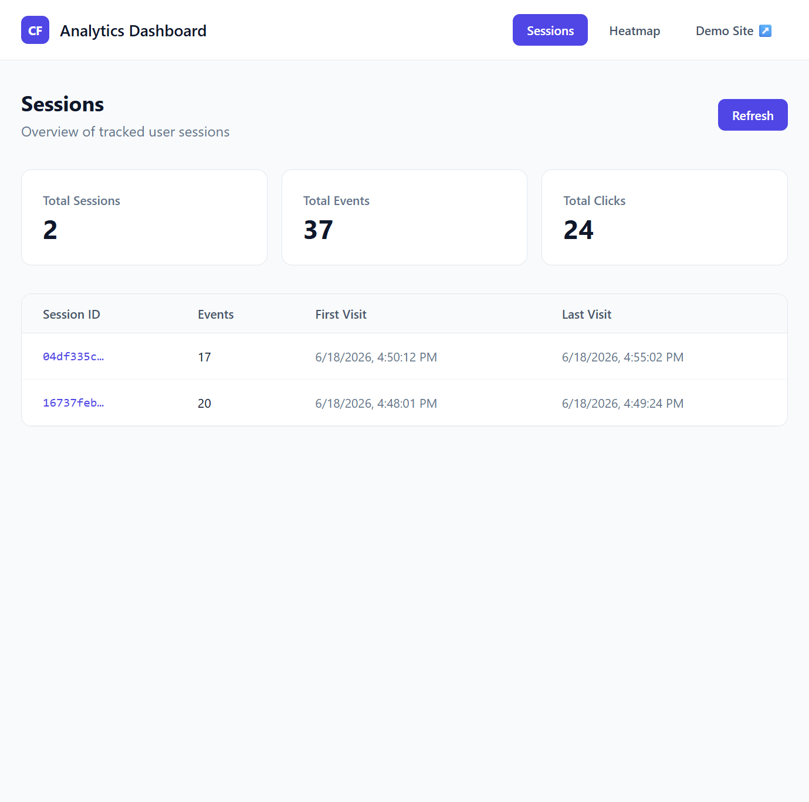
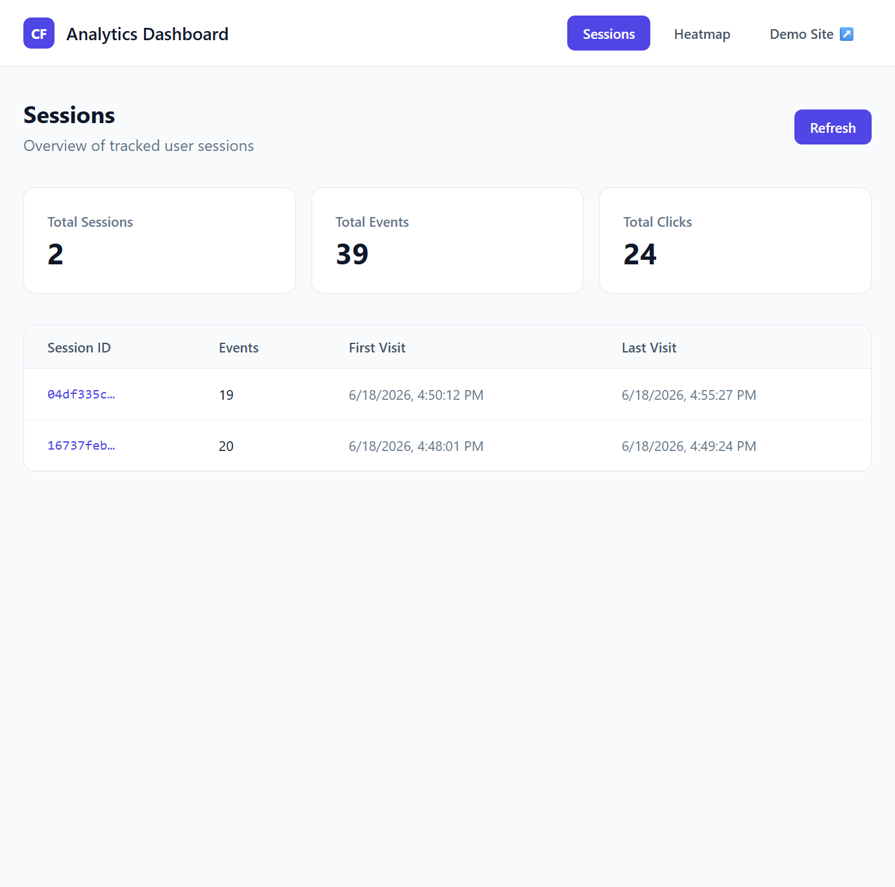
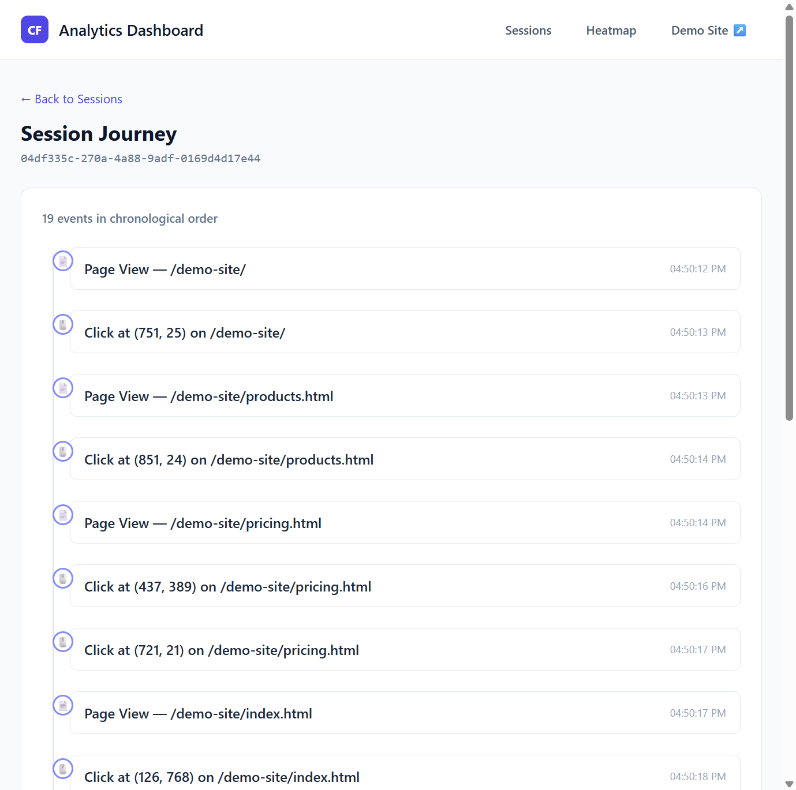
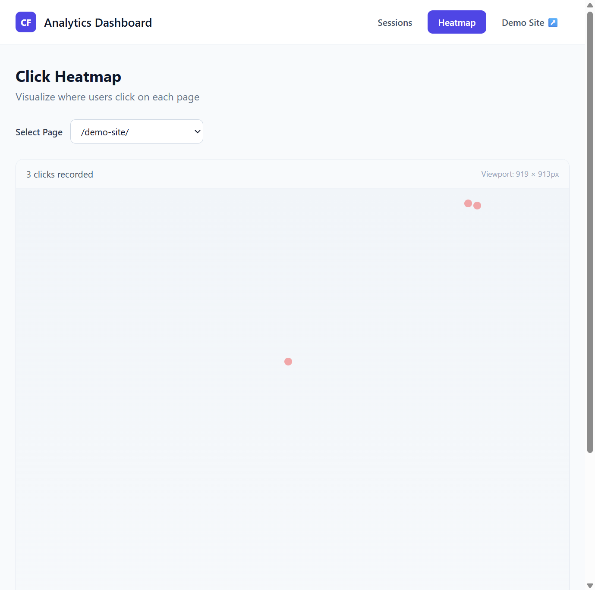

# CausalFunnel User Analytics Application

**Author:** Aman Sigroha  
**Assignment:** Full Stack Engineer — User Analytics Application

A full-stack user analytics platform inspired by Hotjar/Mixpanel. Tracks page views and clicks on a demo e-commerce site, stores events in MongoDB Atlas, and visualizes sessions and heatmaps in a React dashboard.

## Project Overview

| Component | Description |
|-----------|-------------|
| **tracker/** | Lightweight JS snippet embedded on any webpage |
| **backend/** | Node.js + Express API with MongoDB |
| **frontend/** | React dashboard (sessions, journey timeline, heatmap) |
| **demo-site/** | Fake e-commerce store (ShopWave) to generate test data |

## Screenshots

| Demo Store | Sessions Dashboard |
|------------|-------------------|
|  |  |

| Session Journey | Click Heatmap |
|-----------------|---------------|
|  |  |

## Architecture

```
Browser (demo-site + tracker.js)
        │
        ▼ POST /api/events
   Express Backend ──► MongoDB Atlas
        ▲
        │ GET /api/sessions, /heatmap, /pages
   React Dashboard
```

## Tech Stack

- **Tracker:** Vanilla JavaScript (localStorage session, fetch API)
- **Backend:** Node.js, Express, Mongoose
- **Database:** MongoDB Atlas
- **Frontend:** React, Vite, TailwindCSS, Axios, React Router

## Setup

### Prerequisites

- Node.js 18+
- MongoDB Atlas cluster (or local MongoDB)

### 1. Backend

```bash
cd backend
cp .env.example .env
npm install
npm run dev
```

Server runs at `http://localhost:5000` and also serves:
- Demo store → `http://localhost:5000/demo-site/`
- Tracker script → `http://localhost:5000/tracker/tracker.js`

**`.env` example (Atlas):**
```
PORT=5000
MONGODB_URI=mongodb+srv://<user>:<password>@<cluster>.mongodb.net/causalfunnel-analytics?appName=Cluster0
```

> **Tip:** If `mongodb+srv://` fails with DNS errors on Windows, use Atlas's **standard connection string** (non-SRV) with `ssl=true&authSource=admin`.

### 2. Frontend Dashboard

```bash
cd frontend
cp .env.example .env
npm install
npm run dev
```

Dashboard runs at `http://localhost:5173`.

### 3. Generate test data

1. Open **http://localhost:5000/demo-site/**
2. Click buttons, navigate Home → Products → Pricing
3. Open dashboard and click **Refresh**

## Verification Checklist

| Feature | Status | How to verify |
|---------|--------|---------------|
| Page view tracking | ✅ | Open demo site → dashboard shows new session |
| Click tracking | ✅ | Click buttons → Total Clicks increases |
| Session list | ✅ | Sessions table shows ID, event count, timestamps |
| User journey | ✅ | Click a session → chronological timeline |
| Heatmap | ✅ | Heatmap tab → select page → red click dots |
| Demo site buttons | ✅ | Add to Cart / Shop Now show alerts |

**Verified stats (local):** 2 sessions · 39 events · 24 clicks

## API Endpoints

| Method | Endpoint | Description |
|--------|----------|-------------|
| `POST` | `/api/events` | Store a new event |
| `GET` | `/api/sessions` | List sessions with event counts |
| `GET` | `/api/sessions/stats` | Total sessions, events, clicks |
| `GET` | `/api/sessions/:id` | Ordered events for a session |
| `GET` | `/api/heatmap?page=/path` | Click coordinates for a page |
| `GET` | `/api/pages` | Unique page URLs (heatmap dropdown) |
| `GET` | `/api/health` | Health check |

## Troubleshooting

| Issue | Fix |
|-------|-----|
| `npm` blocked in PowerShell | Run `Set-ExecutionPolicy RemoteSigned -Scope CurrentUser` or use `npm.cmd run dev` |
| MongoDB `ECONNREFUSED` | Start local MongoDB or use Atlas connection string |
| Atlas `bad auth` | Reset DB user password; URL-encode special characters in password |
| Atlas IP blocked | Atlas → Network Access → Add your IP or `0.0.0.0/0` |
| Dashboard shows 0 | Use `http://localhost:5000/demo-site/` (not port 3000); click **Refresh** |
| Tracker 404 | Backend must be running — it serves `/tracker/tracker.js` |

## Deployment

| Service | Platform |
|---------|----------|
| Backend | [Render](https://render.com) |
| Database | [MongoDB Atlas](https://www.mongodb.com/cloud/atlas) |
| Frontend | [Vercel](https://vercel.com) |

Set `VITE_API_URL` to your deployed backend URL. Update demo site `ANALYTICS_API_URL` to match.

## Assumptions & Trade-offs

- **Session ID** stored in `localStorage` (assignment allows cookie or localStorage)
- **Single Event collection** — simple schema, aggregation for session summaries
- **Heatmap** uses percentage-based positioning from stored viewport dimensions
- **No authentication** — dashboard is open (appropriate for a demo/MVP)
- **Backend serves demo site** — simplifies local dev (one server, no CORS issues)

## Future Improvements

- Session replay (DOM recording)
- Scroll depth tracking
- Rage click detection
- **Conversion funnels** (relevant to CausalFunnel's domain)
- Device & browser analytics breakdown
- Real-time dashboard with WebSockets
